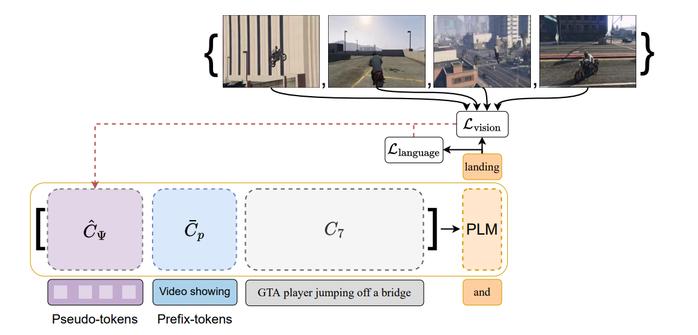
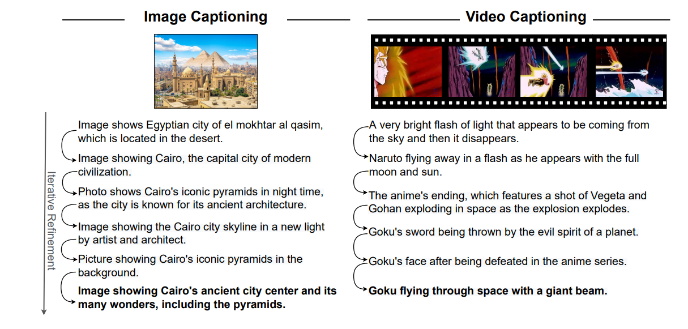

# Official Implementation of [Zero-Shot Video Captioning with Evolving Pseudo-Tokens](https://arxiv.org/abs/2207.11100)

## Approach


## Example of capabilities



### Dependencies

```bash
conda install pytorch==2.0.0 torchvision==0.15.0 torchaudio==2.0.0 pytorch-cuda=11.8 -c pytorch -c nvidia
```

```bash
pip3 install clip-by-openai
```

```bash
pip install chardet
```


## Usage

### To run captioning on a video:

```bash
python run.py --token_wise --randomized_prompt --run_type caption_videos --data_path examples/example_video.mp4
```

### To run captioning on a single image:

```bash
python run.py --token_wise --randomized_prompt --run_type caption_images --data_path examples/example_image.jpg
```

## Citation
Please cite our work if you use it in your research:
```
@article{tewel2022videocap,
  title={Zero-Shot Video Captioning with Evolving Pseudo-Tokens},
  author={Tewel, Yoad and Shalev, Yoav and Nadler, Roy and Schwartz, Idan and Wolf, Lior},
  journal={arXiv preprint arXiv:2207.11100},
  year={2022}
}
```
